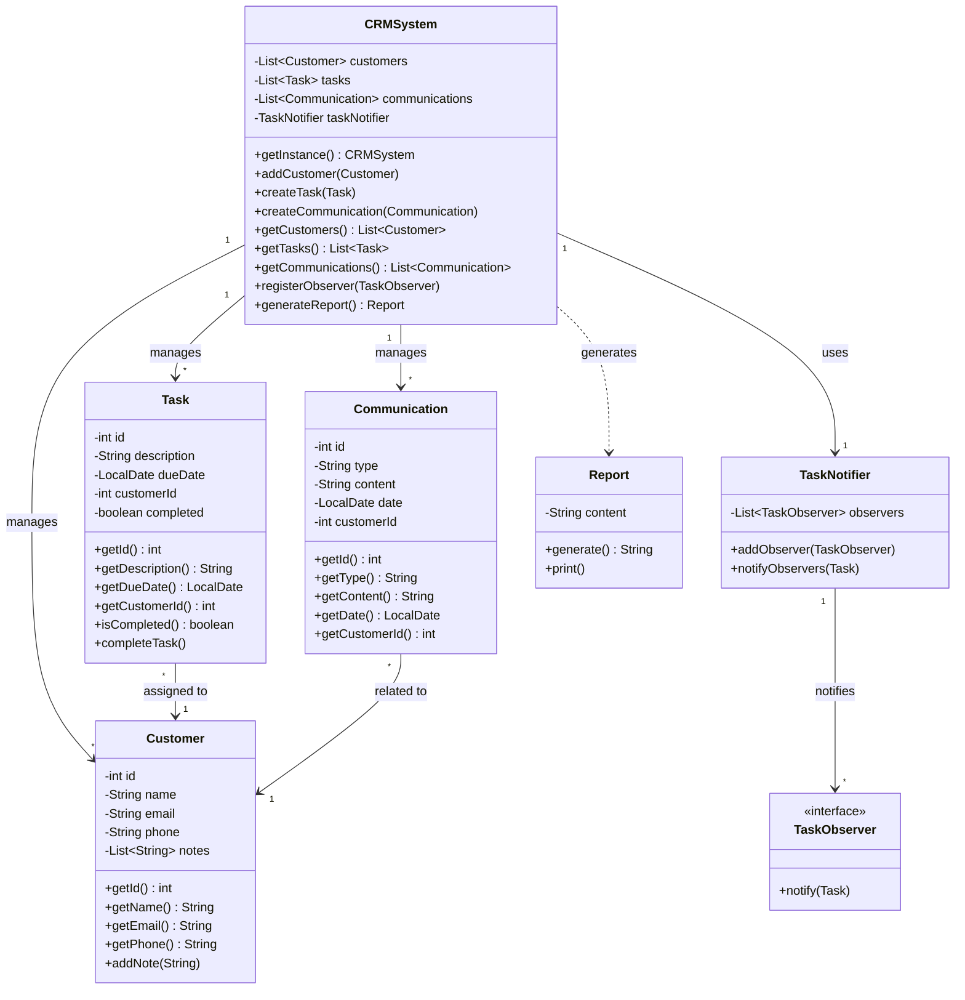
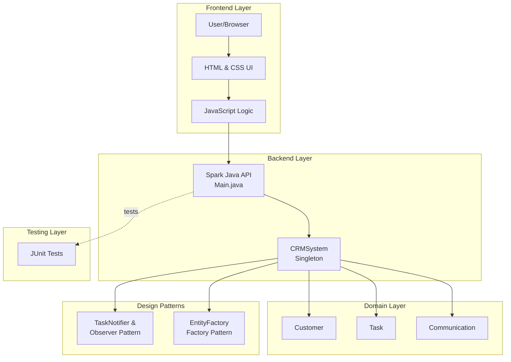

> **Note:** The following Mermaid diagram uses syntax compatible with Mermaid version 10.7.0. If you encounter a syntax error, ensure your Markdown renderer or tool supports at least this version of Mermaid.

# CS1OP-CW1

## Profile
- **Actual Hours Spent:** 30  
- **AI Tools Used:** OpenAI/ChatGPT and GitHub Copilot  

## How to Run the CRM

### Prerequisites
- Java 21 or higher
- Maven 3.x
- A web browser

### Running the Application

1. **Set JAVA_HOME** (if not already set):
   ```powershell
   $env:JAVA_HOME = "C:\Program Files\Java\jdk-21"
   ```

2. **Navigate to the project directory**:
   ```powershell
   cd path\to\cs1op-cw1
   ```

3. **Run the application**:
   ```bash
   mvn exec:java
   ```

   **Alternative (compile first, then run)**:
   ```bash
   mvn clean compile
   mvn exec:java
   ```

4. **Access the application**:
   - Open your web browser and go to: **http://localhost:4567**

5. **Stop the application**:
   - Press `Ctrl+C` in the terminal

---

## How to Navigate the System

Once the application is running, you can access different pages:

### **Main Dashboard** (`http://localhost:4567`)
- Landing page with navigation to all features
- Overview of the CRM system

### **Customer Management** (`/customers.html`)
- **View all customers** in a list format
- **Add new customers** with name, email, and phone
- **Delete customers** by clicking the delete button
- **Search customers** using the search functionality

### **Task Management** (`/tasks.html`)
- **View all tasks** with descriptions, due dates, and status
- **Create new tasks** linked to specific customers
- **Track task completion** and overdue tasks
- Tasks are automatically linked to customer records

### **Communication Tracking** (`/communications.html`)
- **Log communications** (email, phone call, meeting)
- **View communication history** with timestamps
- **Filter communications** by customer
- Communications are automatically added to customer notes

### **Generate Reports** (API endpoint)
- Access via: `http://localhost:4567/api/report`
- View system statistics including:
  - Total customers
  - Total and completed tasks
  - Overdue tasks
  - Total communications

---

**Implementation Highlights**

In the Customer Relations Manager program, the use of Java and HTML as an interface greatly influenced my design format. Due to the need for front-to-backend support, JavaScript was implemented for functionality, and CSS was used on the frontend to help style the Customer Relations Management pages. The CRM (Customer Relationship Management) system was used as a package across each Java file. As Java was integrated with JavaScript, my Main class pulled data from the CRMSystem, which linked to all of the other object classes.

On the frontend, the user can access Customer, Task, and Communication pages to perform the specified requirements. The program was required to handle communication, reporting, and task management between customers. Since we needed an interface for user interaction, I provided a brief instruction guide at the beginning. We were also required to implement three different design patterns: Singleton, Observer, and Factory. These, along with our other Java files, were finally tested.

While creating the advanced program, my assumptions were to use AI as a tool for learning and development. I assumed that all pages could be reviewed and supported by AI for extended assistance. I also assumed that an HTML interface could be used effectively with the help of Maven.

---

## System Diagrams

### Class Diagram



### System Architecture Flowchart


