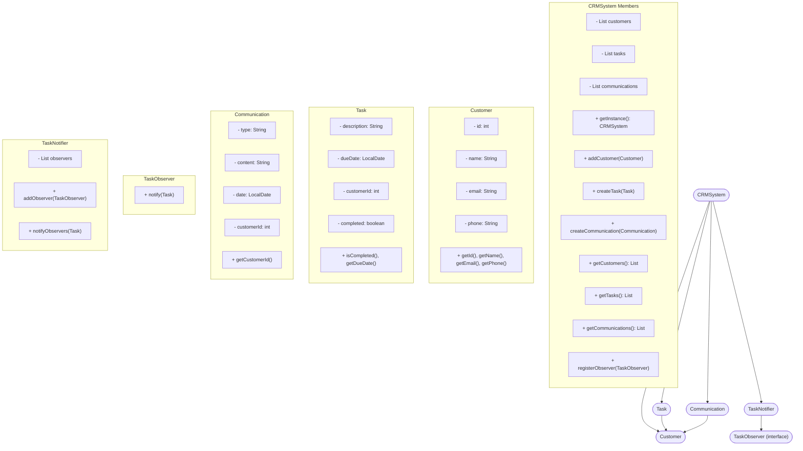

> **Note:** The following Mermaid diagram uses syntax compatible with Mermaid version 10.7.0. If you encounter a syntax error, ensure your Markdown renderer or tool supports at least this version of Mermaid.

# CS1OP-CW1

## Profile
- **Module Code:** CS1OP  
- **Assignment Report Title:** CS1OP-CW1  
- **Student Number:** 33003767  
- **Actual Hours Spent:** 30  
- **AI Tools Used:** OpenAI/ChatGPT and GitHub Copilot  

**Note to run the program on one line use: mvn -f "pom.xml" clean compile, and the next: mvn -f "pom.xml" exec:java**

**Implementation Highlights**

In the Customer Relations Manager program, the use of Java and HTML as an interface greatly influenced my design format. Due to the need for front-to-backend support, JavaScript was implemented for functionality, and CSS was used on the frontend to help style the Customer Relations Management pages. The CRM (Customer Relationship Management) system was used as a package across each Java file. As Java was integrated with JavaScript, my Main class pulled data from the CRMSystem, which linked to all of the other object classes.

On the frontend, the user can access Customer, Task, and Communication pages to perform the specified requirements. The program was required to handle communication, reporting, and task management between customers. Since we needed an interface for user interaction, I provided a brief instruction guide at the beginning. We were also required to implement three different design patterns: Singleton, Observer, and Factory. These, along with our other Java files, were finally tested.

While creating the advanced program, my assumptions were to use AI as a tool for learning and development. I assumed that all pages could be reviewed and supported by AI for extended assistance. I also assumed that an HTML interface could be used effectively with the help of Maven.

Lastly here is the mermaid diagram:

